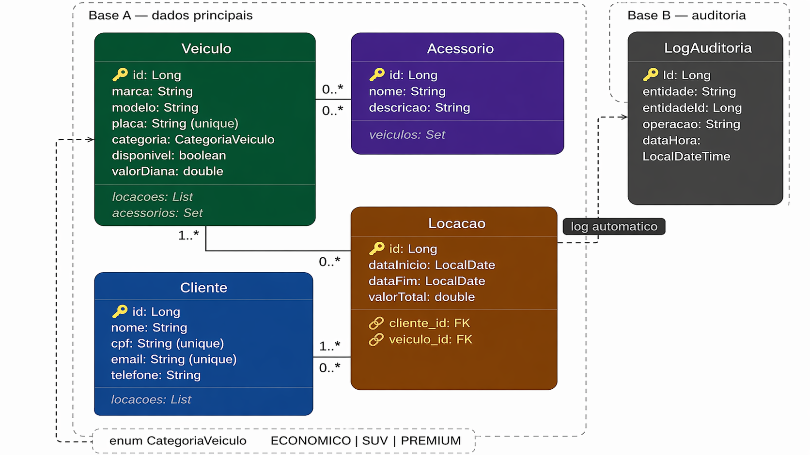

# Sistema de Locação de Veículos — API REST

**Disciplina:** PPGTI 1004 - Desenvolvimento Web II  
**Atividade:** 02 - Sistema de Persistência Híbrida e Relacionamentos  
**Tecnologias:** Java 17, Spring Boot 3.5.13, Spring Data JPA, H2 Database
**Autor:** Glauber Galvão

---

## 1. Domínio Escolhido

Sistema de Locação de Veículos para gerenciamento de frota, clientes e contratos de locação, com rastreabilidade completa via log de auditoria automático.

O domínio foi mantido em continuidade com a Atividade 01, aprofundando a implementação com persistência real via JPA, relacionamentos entre entidades e auditoria automática em base de dados separada.

### Justificativa

O domínio apresenta relacionamentos naturais e não-forçados que atendem todos os requisitos técnicos da atividade:

- Entidades com semântica clara e regras de negócio reais;
- Relacionamentos Many-to-Many e One-to-Many orgânicos ao domínio;
- Operações de negócio que justificam auditoria automática em base separada.

---

## 2. Entidades e Relacionamentos

### 2.1 Diagrama de Relacionamentos



### 2.2 Descrição dos Relacionamentos

| Relacionamento | Entidades | Tipo | Cascade |
|---|---|---|---|
| Um veículo possui muitos acessórios | Veiculo --> Acessorio | Many-to-Many | PERSIST, MERGE |
| Um acessório pertence a muitos veículos | Acessorio --> Veiculo | Many-to-Many (inverso) | — |
| Um veículo possui muitas locações | Veiculo --> Locacao | One-to-Many | ALL + orphanRemoval |
| Uma locação pertence a um veículo | Locacao --> Veiculo | Many-to-One | — |
| Um cliente possui muitas locações | Cliente --> Locacao | One-to-Many | ALL + orphanRemoval |
| Uma locação pertence a um cliente | Locacao --> Cliente | Many-to-One | — |

### 2.3 Atributos por Entidade

| Entidade | Atributos |
|---|---|
| Veiculo | id, marca, modelo, placa (unique), categoria (enum), disponivel, valorDiaria |
| Acessorio | id, nome, descricao |
| Cliente | id, nome, cpf (unique), email (unique), telefone |
| Locacao | id, dataInicio, dataFim, valorTotal, cliente (FK), veiculo (FK) |
| LogAuditoria | id, entidade, entidadeId, operacao, dataHora |

---

## 3. Arquitetura de Persistência

### 3.1 Duas Bases de Dados (H2 em memória)

| Base | Nome | Entidades | Finalidade |
|---|---|---|---|
| Base A (primary) | baseA | Veiculo, Acessorio, Cliente, Locacao | Dados principais |
| Base B (audit) | baseB | LogAuditoria | Rastreabilidade de operações |

A configuração das duas datasources está declarada explicitamente no arquivo `src/main/resources/application.properties`, com `EntityManagerFactory` e `TransactionManager` distintos para cada base.

### 3.2 Log de Auditoria Automático

Toda operação CREATE, UPDATE ou DELETE nas entidades principais dispara automaticamente uma entrada na Base B com os seguintes dados:

| Campo | Descrição |
|---|---|
| entidade | Nome da classe afetada (ex: Veiculo, Cliente) |
| entidadeId | ID do registro modificado |
| operacao | Tipo de operação: CREATE, UPDATE ou DELETE |
| dataHora | Timestamp exato da operação |

---

## 4. Queries Implementadas

| Tipo | Repositório | Método |
|---|---|---|
| JPQL | VeiculoRepository | buscarDisponiveisPorCategoria |
| JPQL | ClienteRepository | buscarPorNome |
| JPQL | LocacaoRepository | buscarPorValorAcimaDe |
| SQL Nativo | VeiculoRepository | buscarTodosDisponiveisNativo |
| SQL Nativo | ClienteRepository | buscarPorEmailNativo |
| SQL Nativo | LocacaoRepository | buscarLocacoesClienteOrdenadas |
| JOIN FETCH | VeiculoRepository | buscarComAcessorios |
| JOIN FETCH | ClienteRepository | buscarComLocacoes |
| JOIN FETCH | LocacaoRepository | buscarComClienteEVeiculo |

---

## 5. Regras de Negócio

| Regra | Entidade | Comportamento |
|---|---|---|
| Valor mínimo por categoria | Veiculo | ECONOMICO ≥ R$ 50 / SUV ≥ R$ 150 / PREMIUM ≥ R$ 300 |
| Disponibilidade | Veiculo | Bloqueio de locação se `disponivel = false` |
| CPF único | Cliente | Rejeita cadastro com CPF já existente |
| Data de fim válida | Locacao | `dataFim` deve ser posterior a `dataInicio` |
| Valor calculado | Locacao | `valorTotal = dias × valorDiaria` (calculado pelo sistema) |
| Devolução | Locacao | Encerramento restaura `disponivel = true` no veículo |

---

## 6. Endpoints

### Acessórios

| Método | Rota | Ação |
|---|---|---|
| POST | /acessorios | Cadastrar |
| GET | /acessorios | Listar todos |
| GET | /acessorios/{id} | Buscar por ID |
| PUT | /acessorios/{id} | Atualizar |
| DELETE | /acessorios/{id} | Deletar |

### Veículos

| Método | Rota | Ação |
|---|---|---|
| POST | /veiculos | Cadastrar |
| GET | /veiculos | Listar todos |
| GET | /veiculos/{id} | Buscar por ID com acessórios (JOIN FETCH) |
| GET | /veiculos/disponiveis?categoria= | Filtrar disponíveis por categoria |
| PUT | /veiculos/{id} | Atualizar |
| DELETE | /veiculos/{id} | Deletar |

### Clientes

| Método | Rota | Ação |
|---|---|---|
| POST | /clientes | Cadastrar |
| GET | /clientes | Listar todos |
| GET | /clientes/{id} | Buscar por ID com locações (JOIN FETCH) |
| PUT | /clientes/{id} | Atualizar |
| DELETE | /clientes/{id} | Deletar |

### Locações

| Método | Rota | Ação |
|---|---|---|
| POST | /locacoes | Criar locação |
| GET | /locacoes | Listar todas |
| GET | /locacoes/{id} | Buscar por ID com cliente e veículo (JOIN FETCH) |
| GET | /locacoes/cliente/{clienteId} | Locações por cliente |
| DELETE | /locacoes/{id}/encerrar | Encerrar locação e liberar veículo |

Ausência do PUT em Locação: uma locação é um contrato firmado entre cliente e veículo — suas condições (datas e valor) são definidas no momento da criação e não devem ser alteradas posteriormente. A única operação de modificação válida é o encerramento, implementado via DELETE /locacoes/{id}/encerrar, que remove o registro e restaura a disponibilidade do veículo. Portanto, essa decisão refletiu uma regra de negócio do domínio, não uma omissão técnica.
---

## 7. Como Executar

### Pré-requisitos

| Requisito | Versão mínima |
|---|---|
| Java | 17 |
| Maven | 3.8 |

### Passos

```bash
# Extrair o projeto e acessar o diretório
cd veiculos2

# Compilar e executar
./mvnw spring-boot:run
```

### Acessos

| Recurso | URL | Observação |
|---|---|---|
| API | http://localhost:8080 | Porta padrão |
| H2 Console — Base A | http://localhost:8080/h2-console | JDBC URL: `jdbc:h2:mem:baseA` |
| H2 Console — Base B | http://localhost:8080/h2-console | JDBC URL: `jdbc:h2:mem:baseB` |

**Credenciais H2 (ambas as bases):** usuário `sa`, senha em branco.

---

## 8. Roteiro de Testes (Postman)
A collection locacao-veiculos2.postman_collection.json deve ser importada no Postman. Os testes devem ser executados na ordem abaixo, pois operações posteriores dependem de dados criados anteriormente.

Fase 1 — Acessórios
#	Requisição	Método	Rota	Resultado esperado
1	Cadastrar Acessório GPS	POST	/acessorios	201 — id: 1
2	Cadastrar Acessório Cadeirinha	POST	/acessorios	201 — id: 2
3	Listar Acessórios	GET	/acessorios	200 — lista com 2 itens
4	Buscar Acessório por ID	GET	/acessorios/1	200 — dados do GPS
5	Atualizar Acessório	PUT	/acessorios/1	200 — nome atualizado

Fase 2 — Veículos
#	Requisição	Método	Rota	Resultado esperado
6	Cadastrar Veículo com acessórios	POST	/veiculos	201 — acessórios vinculados
7	Cadastrar Veículo SUV	POST	/veiculos	201 — id: 2
8	Cadastrar Veículo (erro — valor abaixo do mínimo)	POST	/veiculos	400 — RegraNegocioException
9	Listar Veículos	GET	/veiculos	200 — lista com 2 veículos
10	Buscar Veículo por ID (JOIN FETCH)	GET	/veiculos/1	200 — acessórios carregados em uma única query
11	Buscar Disponíveis por Categoria	GET	/veiculos/disponiveis?categoria=ECONOMICO	200 — Corolla listado

Fase 3 — Clientes
#	Requisição	Método	Rota	Resultado esperado
12	Cadastrar Cliente	POST	/clientes	201 — id: 1, totalLocacoes: 0
13	Cadastrar Cliente (erro — CPF duplicado)	POST	/clientes	400 — RegraNegocioException
14	Cadastrar Cliente (erro — email inválido)	POST	/clientes	400 — erro de validação no campo email
15	Listar Clientes	GET	/clientes	200 — lista com 1 cliente
16	Buscar Cliente por ID	GET	/clientes/1	200 — dados do cliente
17	Buscar Cliente com Locações (JOIN FETCH)	GET	/clientes/1	200 — locações carregadas em uma única query

Fase 4 — Locações
#	Requisição	Método	Rota	Resultado esperado
18	Criar Locação	POST	/locacoes	201 — valorTotal calculado, veículo indisponível
19	Criar Locação (erro — veículo indisponível)	POST	/locacoes	400 — RegraNegocioException
20	Criar Locação (erro — data fim anterior)	POST	/locacoes	400 — RegraNegocioException
21	Listar Locações	GET	/locacoes	200 — lista com 1 locação
22	Buscar Locação por ID	GET	/locacoes/1	200 — dados da locação
23	Buscar Locação com Cliente e Veículo (JOIN FETCH)	GET	/locacoes/1	200 — cliente e veículo carregados em uma única query
24	Buscar Locações por Cliente	GET	/locacoes/cliente/1	200 — lista com 1 locação
25	Encerrar Locação	DELETE	/locacoes/1/encerrar	204 — veículo volta a disponivel: true
Verificação do JOIN FETCH no console

Ao executar os testes 10, 17 e 23, o console da aplicação (com show-sql=true ativo) deve exibir uma única query SQL contendo LEFT JOIN ou JOIN — confirmando que os relacionamentos LAZY foram carregados antecipadamente. A presença de queries separadas para cada relacionamento indica problema na configuração do EntityManager.

Verificação da auditoria (Base B)
Após executar os testes, acesse o H2 Console com jdbc:h2:mem:baseB e execute:

sql SELECT * FROM LOG_AUDITORIA ORDER BY DATA_HORA DESC;

Devem constar entradas para cada operação CREATE, UPDATE e DELETE executada via Postman.

## 9. Arquivos da Entrega

| Arquivo | Descrição |
|---|---|
| `src/` | Código-fonte completo organizado por camadas |
| `pom.xml` | Dependências do projeto |
| `src/main/resources/application.properties` | Configuração das duas datasources |
| `locacao-veiculos2.postman_collection.json` | Collection para teste dos endpoints |
| `diagrama.png` | Diagrama de entidades e relacionamentos |
| `README.md` | Este documento |

---

## 10. Estrutura do Projeto

```
src/main/java/com/locacao/veiculos2/
├── config/         # Configuração das duas datasources (PrimaryDataSourceConfig, AuditDataSourceConfig)
├── controller/     # Endpoints REST (Acessorio, Veiculo, Cliente, Locacao)
├── dto/            # Objetos de transferência de dados (Request e Response)
├── enums/          # CategoriaVeiculo (ECONOMICO, SUV, PREMIUM)
├── exception/      # Exceções customizadas e GlobalExceptionHandler
├── model/
│   ├── primary/    # Entidades da Base A (Veiculo, Acessorio, Cliente, Locacao)
│   └── audit/      # Entidade da Base B (LogAuditoria)
├── repository/
│   ├── primary/    # Repositórios JPA da Base A
│   └── audit/      # Repositório JPA da Base B
└── service/        # Regras de negócio e orquestração (inclui AuditoriaService)
```
